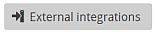

(rn3-external-integrations)=
# RN3 External integrations

```{toctree}
:maxdepth: 2
:caption: Table of Contents
:hidden:

RN3_Generic_Import_Excel
RN3_Generic_Export_Excel
RN3_Generic_Update_prefill_table
RN3_Generic_Update_prefill_dataset
RN3_Generic_Update_attachment_bulkUpload


```

Reportnet 3 provides dataflow managers with the option to design functions that execute selected FME workspaces stored on the EEA's FME Flow server.  
These functions are called external integrations. After the creation, they can be used by RN3 users with appropriate permissions.  

## External integration management

External integrations are set up at the dataset schema level. The Dataflow designer can open the list of existing integrations by clicking the  button in the top-right function bar.  
The option is available both in the dataflow in design and also after it's been published.  

```{figure} img/ExternalIntegrations_window.png
:name: ExternalIntegrationsList
:align: center
:width: 75%

External integrations list - example
```

The existing external integrations can be edited, duplicated, or deleted by clicking the corresponding icon button in the Actions column.  

Clicking the  button in the bottom left opens a setup window for a new external integration.

```{figure} img/CreateExternalIntegration_window.png
:name: CreateExternalIntegration
:align: center
:width: 75%

Create external integration
```
The dataflow designer must enter values into all relevant attribute fields before the external integration can be created.

```{note}
Each documented external integration provides an example of its setup attributes, including custom parameters. Custom parameters are then described and explained in the further sections.
```

External integrations can currently be created only in reporting dataset schemas. The option is disabled in dataset schemas marked as reference datasets. It is, however, possible to create an external integration in a dataset before it's marked as a reference dataset. Such an integration will still be enabled after the change, but it can no longer be inspected, edited, or removed.  

There's currently no option to create external integrations directly on dataflow or table level. The FME workspaces the external integrations execute, however, could be designed to have a broader or narrower impact, although with certain limitations.  

## External integration type

The external integrations are divided based on the type of operation they perform. The RN3 Generic tools and procedures use the following operation types:  
- Import  
- Import from other source  
- Export  


### IMPORT

An external integration with the IMPORT operation adds an option to the **Import dataset data** menu, under the **Custom file import** section.  

```{figure} img/ImportDatasetData70.png
:name: ImportDatasetData
:align: center
:scale: 100%

Import dataset data menu - example
```

The purpose of this external integration type is to allow data providers to import data from files in formats other than CSV.  

After selecting this operation type, an additional setup attribute field - File extension/s - is added to the external integration setup window.  
The dataflow designer must specify which extensions are allowed. This must match the extensions that the corresponding FME workspace can handle.  

### IMPORT FROM OTHER SOURCE

An external integration with the IMPORT FROM OTHER SOURCE operation adds an option to the **Import dataset data** menu, under the **Other custom imports** section.  

The purpose is to give data providers an option to import data from specific external sources, e.g., EEA SQL databases. It's traditionally used to prefill dataset tables.  

The data provider cannot choose which data source a specific external integration should use. If there are more sources, the dataflow designer needs to create separate external integrations for each.

### EXPORT

An external integration with the EXPORT operation adds an option to the **Export dataset data** menu, under the **Custom exports** section.  

```{figure} img/ExportDatasetData70.png
:name: ExportDatasetData
:align: center
:scale: 100%

Export dataset data menu - example
```
The purpose of this external integration type is to provide RN3 users with an option to export data to files in formats other than CSV.  
As with any Export option, the RN3 user must have access to the whole dataflow (requester), or to a specific reporting dataset (data provider).

After selecting this operation type, an additional setup attribute field - File extension - is added to the external integration setup window.  
The dataflow designer must specify the extension of the exported file. This must match the extensions that the corresponding FME workspace can produce.  